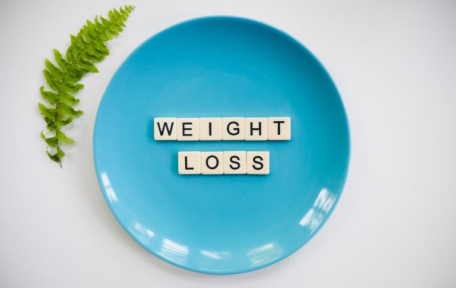

**Si te estás preguntando si el ayuno intermitente es para ti, has llegado al lugar indicado. A continuación voy compartir contigo cuatro de los más importantes Beneficios Del Ayuno Intermitente que obtendrás si lo practicas correctamente.**

Como ya lo sabes, el ayuno intermitente es un protocolo alimenticio en cual se tiene una ventana de tiempo para comer (ingerir calorías) y una ventana de tiempo para ayunar (No ingerir calorías), ya por naturaleza tenemos cierta ventana de ayuno, normalmente durante la noche mientras dormimos, es por esto que la primera comida del día durante la mañana la llamamos "des-ayuno".

El protocolo más común es el llamado 16:8 en el cual tenemos 16 horas de ayuno y 8 horas para consumir nuestros alimentos.

Si eres nuevo en el ayuno intermitente probablemente en este momento te estarás preguntando como hacerle para no comer durante 16 horas. Bueno, en realidad no es tan difícil si consideras que la mitad de esas 16 horas las pasas dormido.

> Si quieres aprender más sobre como comenzar a implementar el Ayuno Intermitente en tu vida diaria, [descarga la Guía Rápida](https://ayunointermitente.blog/acerca/) **¡Es Gratis!**

## 1\. Te Ayuda a Bajar De Peso.

Photo by Natasha Spencer from Pexels

Puesto que básicamente te estarías saltando el desayuno, en teoría deberías de comer menos lo cual [te ayudará a bajar de peso](https://ayunointermitente.blog/ayuno-intermitente-para-bajar-de-peso/) si ese es tu objetivo.

Contrario a lo que se cree, el ayuno no hace que disminuya tu metabolismo, al contrario, lo [incrementa en un 3.6% después de las primeras 48 horas.](https://www.ncbi.nlm.nih.gov/pubmed/2405717)\[1\]

Al tener una ventana de 8 horas (o menos, dependiendo el protocolo que elijas) es más probable que te sea más fácil adherirte a la cantidad de calorías que debes consumir en el día. A su vez he notado que puedes disfrutar de porciones más generosas en vez de tener que comer porciones pequeñas durante el día y nunca sentirte satisfecho.

## 2\. Mejora tu salud.

El ayuno Intermitente puede reducir la resistencia a la insulina disminuyendo el azúcar en la sangre alrededor de 3% a 6% y los niveles de insulina en ayuna de un 20% a un 30%. Lo cual [puede ayudar a combatir la diabetes tipo 2](<https://www.translationalres.com/article/S1931-5244(14)00200-X/abstract>). \[2\]

[Estudios recientes](https://www.surrey.ac.uk/news/fasting-diets-reduce-important-risk-factor-cardiovascular-disease) mostraron que el ayuno intermitente ayuda a bajar los triglicéridos en la sangre. Los niveles altos de triglicéridos en la sangre se considera otro factor de riesgo grave de enfermedad cardiovascular y accidente cerebrovascular.

## 3\. Ayuda a Evitar La Descompensación Horaria (Jet Lag).

Si alguna vez has viajado de un país a otro o simplemente de un estado a otro con diferente zona horaria seguramente habrás experimentado el famoso "Jet Lag". Algunos síntomas son dolor de cabeza, cansancio, insomnio, etcétera.

Te cuento rápidamente que esto tiene que ver con nuestro "reloj" interno o biológico que principalmente está gobernado por la luz del sol, es decir, nuestro cuerpo está coordinado con el día y la noche, de día somos más activos, nuestro cuerpo está preparado para ingerir alimentos mientras que por la noche nuestro cuerpo se prepara para descansar y recuperarse.

Así pues, abstenerte te ingerir alimentos por un tiempo permite a tu cuerpo restablecerse y una vez que ingieres tu primer alimento durante la mañana es como si sincronizaras tu reloj biológico con el día.

Una nota importante es que durante estos viajes **debes mantenerte siempre bien hidratado** si quieres obtener los beneficios del ayuno intermitente.

## 4\. Conveniencia.

Cuando me levanto en la mañana no necesito pensar que voy a desayunar, tampoco pasar mucho tiempo preparando alimentos. Simplemente me levanto, me doy un baño, medito, preparo mi café y ya estoy listo para comenzar el día.

Al no tener que pensar que voy a comer durante la mañana me da oportunidad de ocuparme en otras cosas, al mismo tiempo el mantenerme ocupado me ayuda a no estar pensando en comer y me hace más llevadero mi ayuno.

Como puedes estos son algunos importantes beneficios del ayuno intermitente, pero como todo en la vida, no todo es color de rosa. Te recomiendo leas el siguiente artículo para conocer cuales son los errores más comunes que cometemos al practicar el ayuno intermitente.
