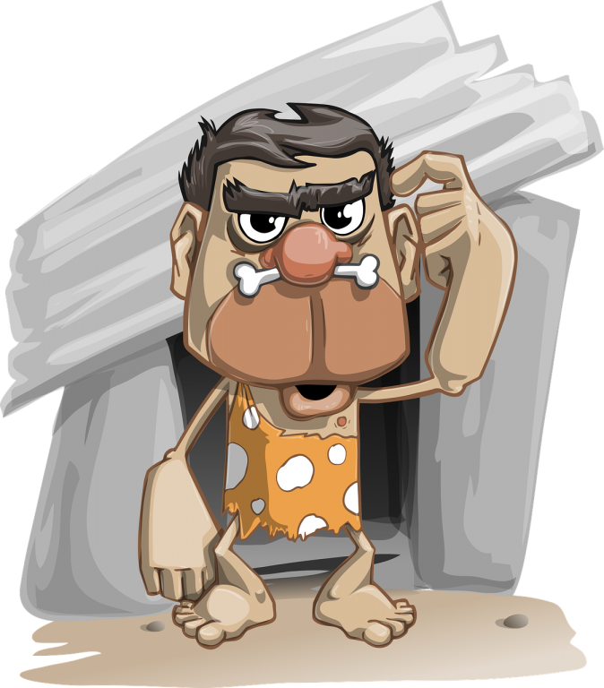
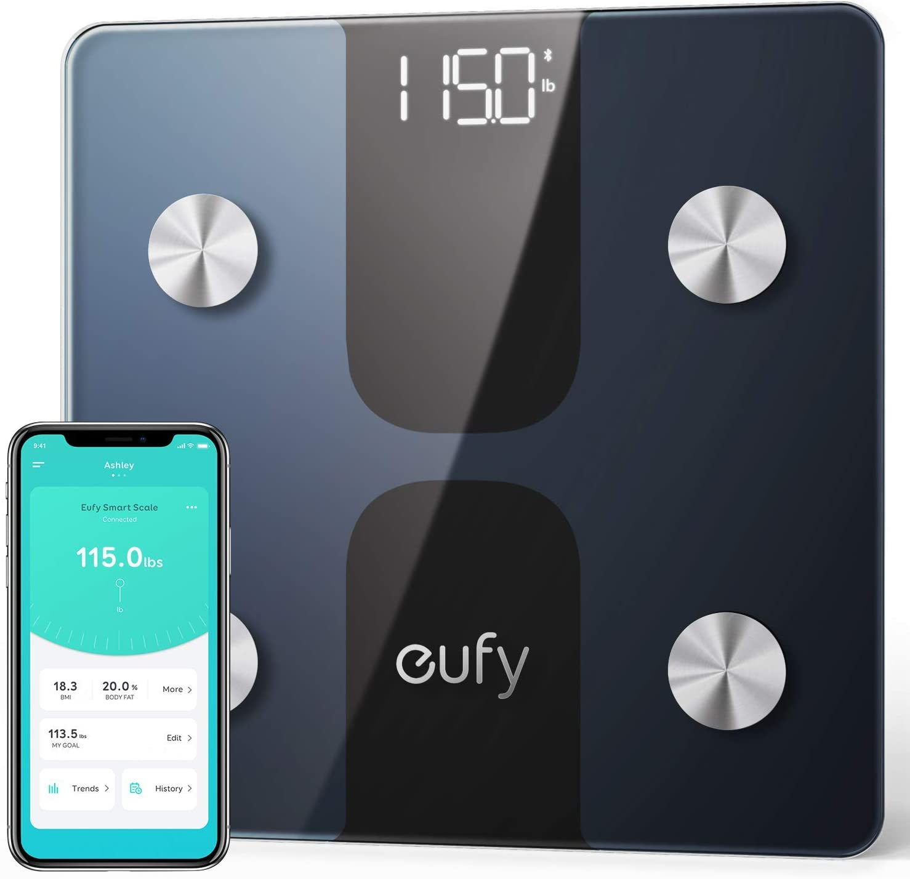
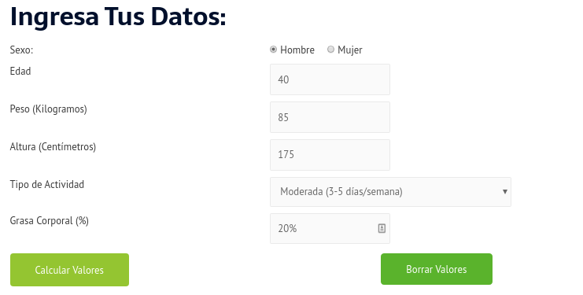
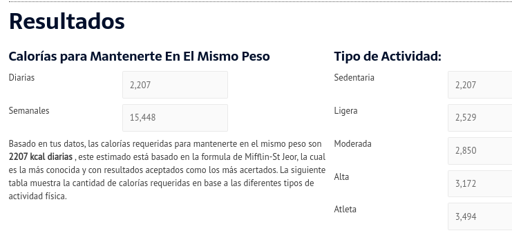

**Como ya lo sabes el Ayuno Intermite no es una dieta, pero ¿Haciendo Ayuno Intermitente automáticamente vas a bajar de peso?**

Es muy emocionante ver que más y más personas están adoptando este nuevo estilo de vida y disfrutando de los [beneficios del Ayuno Intermitente](https://ayunointermitente.blog/4-beneficios-del-ayuno-intermitente/).

Bueno, pues te tengo dos noticias, una buena y una mala.

La mala noticia es que no existe una fórmula, pastilla o crema mágica que te va a hacer bajar de peso sin hacer ningún esfuerzo, pero esto ya todos lo sabemos.

**La buena noticia es que haciendo el Ayuno Intermitente sí puedes bajar de peso**, no es garantía pero sabiendo utilizar esta herramienta correctamente te va a ayudar a lograr tu objetivo.

El secreto, que en realidad no es tan secreto, es que para bajar de peso debes crear un déficit calórico, esto hace que tu cuerpo utilice la grasa almacenada como reserva de energía.

## ¿Como ayuda el Ayuno Intermitente a Bajar de Peso?

Como ya sabrás existen [diferentes protocolos de Ayuno Intermitente](https://ayunointermitente.blog/tipos-de-ayuno-intermitente/) los cuales consisten en tener una ventana de tiempo para ayunar por otra ventana o lapso para consumir alimentos.

Al tener una ventana de tiempo reducida para consumir alimentos, en teoría, deberías de comenzar a consumir menos calorías de las que normalmente consumes.

Esto te ayudará a crear un déficit calórico. A no ser que compenses las horas de ayuno con comida de más o con alimentos altos en carbohidratos refinados y azúcares.

Otra cosa muy importante en la cual **el ayuno intermitente te puede ayudar a bajar de peso** es que si llevas un ayuno de 18 horas o más, el cuerpo agotará las reservas de glucógeno y comenzará el proceso de lipolisis.

La lipolisis es un proceso dentro del cuerpo que permite la movilización de los lípidos almacenados en el tejido adiposo como reserva de combustible hacia los tejidos periféricos para cubrir las necesidades energéticas.

Es decir, tu cuerpo comienza a utilizar la grasa como energía.

[Algunos estudios](https://translational-medicine.biomedcentral.com/articles/10.1186/s12967-016-1044-0) mostraron que combinando el ayuno intermitente con ejercicio de resistencia puede reducir más grasa que solo haciendo ejercicio de resistencia.

Sin embargo, esto no es óptimo si tu objetivo es crear músculo.

## ¿Porqué es tan difícil deshacerse de la grasa almacenada en nuestro cuerpo?

**Nuestro cuerpo, por naturaleza, está diseñado para sobrevivir**.

El ser humano desde que apareció en la tierra ha tenido que **realizar algún tipo de esfuerzo físico para encontrar alimento**, ya sea cazando o recolectando frutos y semillas.

La caza y recolección son actividades de temporada, es decir, no siempre hay animales para cazar o frutos para recolectar, por lo tanto el ser humano hace miles de años a diferencia de nosotros que vivimos en esta época, no tenía comida a su alcance todo el tiempo.

Había épocas del año en las cuales había abundante comida, probablemente porque la cacería había sido buena o simplemente había abundantes frutas y semillas para recolectar puesto que era la temporada en la cual se podían encontrar.

Durante esta época, cuando la comida es abundante, el cuerpo a manera de adaptación y supervivencia almacena energía en forma de grasa para ser utilizada después. Como decía mi abuelo, había que preparase para la época de "vacas flacas".

Hoy en día afortunadamente para muchas personas este ya no es un problema, pero por otro lado, nuestro cuerpo no ha evolucionado en este sentido y cada que hay comida suficiente, se protege almacenando reservas de energía para cuando lleguen los tiempos malos y no tengamos nada que comer.

**Está energía almacenada en el cuerpo en forma de grasa es utilizada únicamente si es requerida, esto es lo que hace que sea difícil de deshacerse de ella.**

Entonces entendiendo que nuestro cuerpo almacena grasa por naturaleza y que solo la va a utilizar si la requiere, hará menos difícil de entender porque si queremos deshacernos de esa grasa tenemos que lograr un déficit calórico, no existe ninguna otra manera de "quemar la grasa" en el cuerpo.

## ¿Cómo se consigue un déficit calórico?

El déficit calórico se refiere a un resultado negativo entre las calorías consumidas menos las calorías que necesita tu cuerpo, es decir, cuando las calorías requeridas por el cuerpo son mayores que las ingeridas.

Esto se puede conseguir de dos formas:

1. Consumiendo menos calorías de las quemas durante el día.
2. Quemando más calorías de las que ingieres durante el día.

Una vez que entendí que la única manera de quemar grasa y bajar de peso sanamente es consiguiendo un déficit calórico, mi siguiente duda fue:

## ¿Cuántas calorías diarias necesita mi cuerpo?

A estas calorías requeridas para que el cuerpo funcione se le conoce como Gasto Energético Diario.

He creado una [Calculadora de Gasto Energético Diario](https://ayunointermitente.blog/calculadora-indice-masa-corporal/) que te permite saber estos datos fácilmente.

Es muy sencilla de utilizar, solo necesitas saber tu peso actual en kilogramos, tu estatura en centímetros y preferentemente tu porcentaje de grasa corporal.

No te preocupes si no sabes tu porcentaje de grasa corporal, lo puedes dejar en blanco mientras consigues una de estas básculas que te dan todos los datos.

### Básculas Inteligentes

 

  

Veamos un ejemplo:

Supongamos que nuestro sujeto es un hombre de 40 años con un peso de 85 kilogramos, una estatura de 175 cm. (1 metro 75 centímetros), un porcentaje de grasa corporal del 20%, que se ejercita al menos una hora 3 veces a la semana y desea perder peso para llegar a su peso "ideal" de 72 kilogramos.

* * *

Calculadora de Gasto Energético Diario

* * *

Este sujeto tiene un gasto energético diario de **2,207 calorías**, en la tabla de la derecha en los resultados, la calculadora te muestra el gasto energético diario para cada uno de los tipos de actividad.

Lo que los expertos recomiendan para bajar de peso de manera sana es consumir **500 calorías por debajo del gasto energético diario**, en nuestro ejemplo anterior sería 2,207 - 500 = **1,707 calorías**.

## ¿Como puedo saber cuantas calorías estoy consumiendo?

Cabe destacar en este momento que el número de calorías son estimadas, tanto las que se consumen como las que se gastan.

Un gramo carbohidratos contienen 4 calorías.

De igual manera 1 gramo de proteína contiene 4 calorías.

Por otro lado, un gramo de grasa contiene 9 calorías.

Afortunadamente vivimos en los tiempos de la tecnología y existen aplicaciones que puedes instalar en tu celular que te permiten llevar un registro de los alimentos que consumes durante el día y te van sumando las calorías ingeridas.

Las apps que yo te recomiendo son:

MyFitnessPal

Lose It!

Si encuentras este artículo por favor compártelo con tus amigos y familiares en cualquiera de las siguientes redes sociales o incluso se los puedes enviar por email.

_Algunas de las ligas contenidas en este artículo son afiliados._
