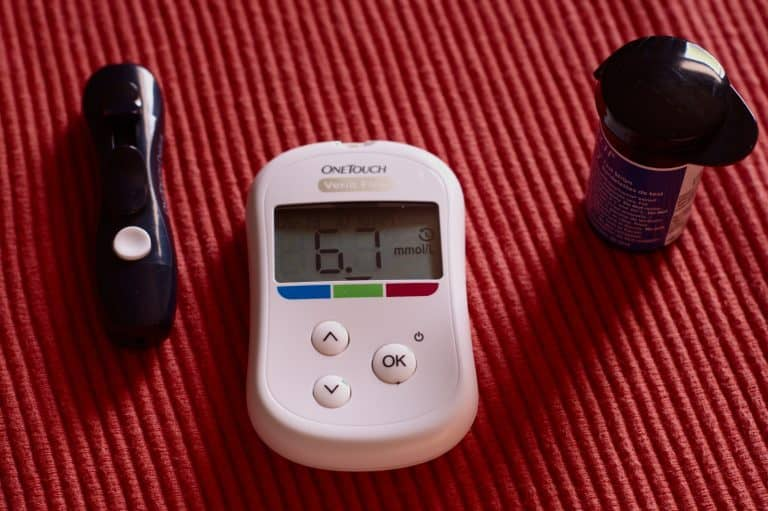

## **Ayuno intermitente y Diabetes: ¿Puedo realizarlo si padezco esta enfermedad?**

El ayuno intermitente es una práctica alimenticia que ha dado mucho de qué hablar en los últimos años, sin embargo, también han surgido muchas dudas respecto a su efectividad y a [cuán beneficiosa puede ser en ciertos casos específicos](https://ayunointermitente.blog/4-beneficios-del-ayuno-intermitente/).

Uno de ellos tiene que ver con la Diabetes, muchos pacientes se preguntan si pueden implementar un régimen de este estilo aun cuando padecen esta enfermedad. ¿Eres uno de ellos y quieres conocer la respuesta? Entonces… ¡Continúa leyendo!

## **¿Puedo hacer ayuno intermitente si sufro de Diabetes?**

Esta pregunta debe estar rondando tu cabeza si has llegado hasta aquí y lo cierto es que, si conoces la Diabetes, ya sea de primera mano o a través de algún familiar, es muy probable que te hayas cuestionado si esta dieta puede ser de ayuda. Además de ser muy útil para [bajar de peso](https://ayunointermitente.blog/ayuno-intermitente-para-bajar-de-peso/), el ayuno intermitente es muy ventajoso para el tratamiento y prevención de la Diabetes, especialmente de la Diabetes tipo 2.

Claro, es muy importante que todo proceso **se realice bajo supervisión y consulta médica**, pero si una persona mantiene una alimentación adecuada durante las horas contrarias al ayuno, entonces podrá aportarle cosas muy positivas a su cuerpo.

Un paciente con Diabetes puede hacer ayuno intermitente si su especialista lo permite y siempre adaptándolo a sus necesidades. Como hemos mencionado, e[s ideal para controlar el exceso de peso](https://ayunointermitente.blog/ayuno-intermitente-para-bajar-de-peso/) lo cual es el primer paso a seguir para el tratamiento de la enfermedad.

## **¿Porqué algunos especialistas recomiendan el ayuno intermitente en pacientes con Diabetes?**

En primera instancia, tenemos que una dieta a base de ayuno intermitente favorece la eliminación del sobrepeso. Se han realizado estudios en cuanto a la relación existente entre el sobrepeso y la obesidad con la Diabetes, y se ha concluido que el vínculo es bastante fuerte.

Un [estudio reciente realizado en la Clínica de Administración Intensiva de la Dieta en Toronto, Canada](https://www.ncbi.nlm.nih.gov/pubmed/30301822), mostró la efectividad del ayuno terapéutico para revertir la resistencia a la insulina en tres pacientes dando como resultado el cese de administración de insulina terapéutica.

Para prevenir la diabetes, se recomienda evitar a toda costa el aumento desmedido de peso. Si ya se padece y se pretende tratar, se aconseja mantener el peso ideal y una alimentación balanceada.

Aunado a ello, se ha descubierto que el ayuno intermitente genera un efecto muy positivo en el páncreas. Esto se debe a que, durante los períodos en los que se lleve a cabo, se produce un nivel más reducido de grasa pancreática. Este hecho previene la Diabetes de tipo 2 de forma muy efectiva en casi todo tipo de personas.

El ayuno intermitente detiene la formación de los depósitos de grasa, factor muy asociado a la Diabetes, debido a que reestructura los hábitos alimenticios mientras mejora el funcionamiento de organismo en general y evita todo lo que pueda ser perjudicial para el cuerpo.

¿Aún tienes dudas sobre el ayuno intermitente y la Diabetes? ¡Puedes estar atento a nuestros nuevos post! Tenemos mucha más información al respeto. **Pero, como hemos dicho antes, siempre es prudente consultar con tu médico de cabecera sobre todo aquellos que pretendas realizar, especialmente si estás bajo un diagnóstico.**
