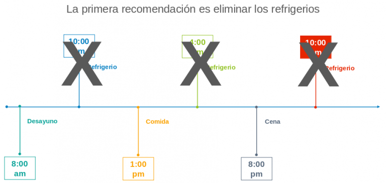
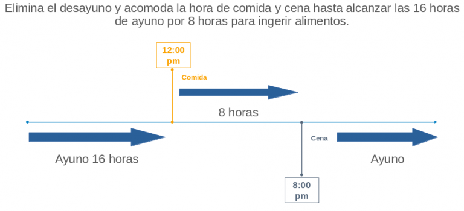

Al principio cuando me decidí a practicar el ayuno intermitente tenía muchas dudas y pensaba que era muy complicado, a lo mejor esto mismo te pasa a ti.

¿Cómo Comenzar El Ayuno Intermitente? **Iniciar no debe ser difícil, lo recomendable es comenzar poco a poco, comenzar con un ayuno de 12 horas e ir aumentando el número de horas a 14, 16 luego a 18. En este artículo podrás encontrar algunos consejos que espero te sean de utilidad.**

La verdad después de investigar y leer algunos libros me di cuenta que el ayuno intermitente no debe ser tan complicado.

Probablemente tú, al igual que yo también te has hecho algunas de estas preguntas:

Durante mi ayuno ¿Puedo tomar agua?

Por supuesto que debes tomar agua, mucha, debes mantenerte hidratado.

¿Puedo tomar té? ¿Puedo tomar café?

Sí, siempre y cuando sea sin azúcar ni leche.

**Encuentra más información en [¿Qué rompe el ayuno intermitente?](https://ayunointermitente.blog/que-rompe-el-ayuno-intermitente/)**

El verdadero ayuno, por definición, es la restricción calórica durante un periodo de tiempo, es decir, no ingerir ningún tipo de alimento y beber únicamente agua.

Hasta hoy los científicos no han llegado a un consenso para determinar cuantas calorías ingeridas en realidad puede romper el ayuno.

Así que tomar café sin azúcar ni leche, té o agua con unas pocas gotas de limón no hace mal.

Algunos estudios concluyeron que para estar en ayunas el individuo **no debe consumir más de 50 calorías.**

Al ayuno no se trata de morirse de hambre, eso es inanición, la diferencia es que el primero es por elección, el segundo es por imposición.

## ¿Cómo comenzar El Ayuno Intermitente?

### La primera barrera a vencer es tu propia mente.

Al inicio solo de pensar que no iba a desayunar me hacía sentir más hambre, me hacía pensar que si no desayunaba no iba a tener energía para desempeñarme en el trabajo y que me iba a ser difícil concentrarme.

Nada más alejado de la realidad, la verdad es que uno de tantos [beneficios del ayuno intermitente](https://ayunointermitente.blog/4-beneficios-del-ayuno-intermitente/) es que hace que tu cuerpo utilice grasa como combustible.

Este proceso hace que tu cuerpo produzca cetonas y tu cerebro prefiere las cetonas a la glucosa.

Las cetonas hacen que te puedas concentrar mejor, te mantiene alerta.

### Aprende a reconocer cuando realmente tienes hambre.

Otra cosa que también tuve que aprender es a dejar que mi cuerpo me diga cuando debo de comer.

Tuve que aprender a reconocer cuando realmente es cuando tengo hambre, cuando es solo un antojo o muchas veces incluso la misma sed puede causar una sensación en el estómago como si fuera hambre.

Estaba acostumbrado a comer tres veces al día e incluso algunos días, principalmente los fines de semana, hasta tomaba un refrigerio entre comidas.

Si este es también tu caso la primera recomendación es la de **dejar de comer esos refrigerios**.

Una vez que tu cuerpo se haya acostumbrado y ya no necesites comer refrigerios durante el día, el siguiente paso es ir empujando tu hora del desayuno.

### Poco a poco recorre la hora del desayuno hasta que solo hagas 2 comidas al día.

Digamos que regularmente desayunas a las 8:00 de la mañana, entonces lo siguiente es comenzar a desayunar a las 10:00 a.m., después simplemente te saltas el desayuno, y comes hasta el medio día.

De 5 comidas que hacía, las pude reducir a 3, luego a dos, hay gente que incluso una comida al día es suficiente.

La verdad es que toma tiempo para que el cuerpo utilice la grasa y deje de utilizar azúcar como combustible, de hecho hay personas a quienes les toma hasta 3 o 4 meses, así que debes tener paciencia y ser consistente.

### Recomendaciones Importantes

Para poder lograr esto las recomendaciones principales son:

1\. Disminuye el consumo de azúcar y carbohidratos refinados, como son el pan, las tortillas y el harina en general.

2\. Aumenta el consumo de grasas buenas

3\. Aumenta el consumo de verduras, consumir verduras es muy importante para obtener las vitaminas y minerales requeridos, como el magnesio, el potasio, etcétera para que tu cuerpo siga funcionando.

También son importantes por la fibra que contienen, la fibra ayuda a mantener tu aparato digestivo funcionando correctamente.

Algunas personas pueden experimentar dolor de cabeza, de músculos, incluso nauseas, si ese es el caso los especialistas recomiendan incluir la sal de mar en sus comidas.

También recomiendan añadir una poca de sal de mar al agua de diario. También recomiendan el consumo de electrolitos.

La clave para que sea menos difícil aguantar el hambre, es mantenerse ocupado para no estar viendo el reloj y estar pensando nada más a que hora vas a comer.

Puedes salir a caminar, si tienes perro llévalo a pasear, si tienes hijos sal a jugar con ellos, etcétera.

### Otro consejo muy importante es el de preparar tus alimentos con anticipación.

Como la idea es de comer cuando realmente tienes hambre, es muy recomendable que tengas listo lo que vas a comer para romper tu ayuno.

De esta manera será menos probable que comas otra cosa, algo que no debas comer o que comas demás.

Cuando comas tu primera comida después de ayunar, siéntate tranquilo en la mesa, no en el sofá, no en la cama de la recamara, en la mesa del comedor, sin distracciones.

Comer sin distracciones y concentrado en el momento te permitirá disfrutar tus alimentos y hará que te sientas satisfecho y no busques más que comer.

Bueno, pues espero que con esto se te hayan disipado algunas dudas y estés más decidido en comenzar el ayuno intermitente como tu nuevo estilo de vida.

Sígueme en Twitter o Instagram para más información.
