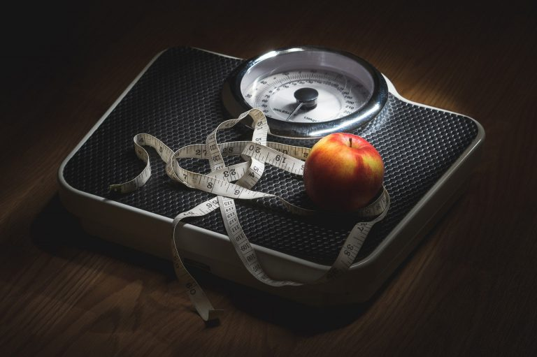

Esta es una de las primeras preguntas que surgen al comenzar el ayuno intermitente, como ya sabemos el ayuno intermitente no es una dieta, es un estilo de vida. Por cierto, no te despegues pues en el próximo artículo te voy a explicar porque la palabra "dieta" es algo que no escucharás (o mejor dicho, leerás) en este blog. Entonces:

¿Cuántas veces a la semana se debe hacer el ayuno intermitente? **El ayuno intermitente, al ser un estilo de vida, se puede hacer los siete días de la semana, es un protocolo de alimentación en el cual se restringe el consumo de calorías durante un periodo de tiempo determinado, seguido de un periodo de alimentación normal.**

Aún y cuando el ayuno intermitente ha tomado mucha popularidad recientemente, no es algo nuevo, de hecho podemos encontrar muchos escritos de personajes famosos de épocas muy antiguas, algunos de ellos emperadores Romanos o filósofos Griegos.

Por ejemplo, el Emperador Romano Marcos Aurelio fue conocido como el Emperador Estoico y uno de los ejercicios que practicaba era el llamado "Incomodidad Voluntaria".

> "Pero ni un toro ni un hombre de espíritu noble llegan a ser lo que son a la vez; debe realizar un duro entrenamiento de invierno y prepararse, y no impulsarse precipitadamente hacia lo que no es apropiado para él"
>
> \- Epicteto

En este ejercicio de "Incomodidad Voluntaria" como su nombre lo dice, los Estoicos se ponen en ciertas situaciones incómodas de manera voluntaria para recordarse y entrenarse por si algún día llegasen a vivir sin esas comodidades, estas situaciones eran por ejemplo:

-   Baños con agua fría
-   Hacer ejercicio por la mañana
-   Caminar en el frío sin suéter o abrigo
-   Ayunar por un día
-   Dormir en el piso

Todo esto era con el fin de entrenarse o más bien saber que puedes esperar en caso de que estas situaciones se presenten.

Volviendo al tema de **¿Cuántas veces a la semana se debe hacer el ayuno intermitente?**

Otro factor a considerar es el motivo por el cual te has decidido a hacer practicar este protocolo de alimentación. Voy a asumir que como la mayoría de las personas, lo que estás buscando realizar el [ayuno intermitente para bajar de peso](https://ayunointermitente.blog/ayuno-intermitente-para-bajar-de-peso/).

Si este es el caso y eres principiante, te voy a recomendar que no apresures el proceso, [El Centro para el Control y Prevención de Enfermedades del Gobierno de Los Estados Unidos de Norteamérica](https://www.cdc.gov/healthyweight/spanish/losingweight/index.html) recomienda bajar de 1 a 2 libras por semana para que se considere saludable.

Comienza con ayuno de 14 horas saltándote el desayuno en la mañana, te recomiendo esto porque las 8 horas que pasas dormida también cuentan como ayuno.

Por lo tanto, imagínate que tu última comida será a las 8:00 de la noche, tu ventana de ayuno sería de las 8 de la noche a las 10 de la mañana del siguiente día. Desde mi punto de vista, este [horario para realizar el ayuno intermitente](https://ayunointermitente.blog/ayuno-intermitente-horarios/) no es muy agresivo para comenzar.

Por otro lado, si eres principiante y se te complica, te recomiendo que comiences de manera paulatina, es decir, comienza alternando los días en los cuales realizarás el ayuno, por ejemplo:

Comienza por ayunar durante 14 horas los Lunes, Miércoles y los Viernes. Si te sientes bien durante estos días y no tienes tropezones, trata de ayunar también el Sábado o Domingo.

Una vez que tu cuerpo se acostumbra, el siguiente paso será ayunar todos los días entre semana, "descansando" los fines de semana, pero recuerda que bajar de peso es un proceso lento, debes tener paciencia, poco a poco irás acostumbrándote y desarrollarás el nuevo hábito, no es fácil, pero tampoco es imposible.

[El ayuno intermitente tiene muchos beneficios](https://ayunointermitente.blog/4-beneficios-del-ayuno-intermitente/), además de ayudarte a bajar de peso, dispara la hormona del crecimiento, te hace sensible a la insulina y dispara el proceso de Autofagia.

Para comenzar a obtener dichos beneficios, algunos estudios indican que se debe ayunar por al menos 16 horas, por eso el ayuno 16:8 es el más popular.

El Ayuno 16:8 es donde la persona ayuna por 16 horas y tiene 8 horas para consumir sus alimentos. Existen otros [protocolos de ayuno intermitente](https://ayunointermitente.blog/tipos-de-ayuno-intermitente/) como por ejemplo el 18:6 y 20:4 entre otros.

Algo que es muy importante y no debes perder de vista es la cantidad de calorías que debes consumir para conseguir un déficit calórico. La única manera de bajar de peso es consumiendo menos calorías de las que tu cuerpo quema durante el día.

Cuando recién comencé a hacer el ayuno intermitente noté que pude bajar de peso rápidamente, esto me motivó a continuar, pero debes tener en cuenta que esa pérdida de peso es normal con cualquier tipo de dieta.

Sí, está bien motivarse pero al mismo tiempo debes entender que tu cuerpo se irá adaptando a tus nuevos hábitos lo que hará que vayas reduciendo tallas en vez de perder peso.

Así pues ¿Cuántas veces a la semana se debe hacer el ayuno intermitente? Todos los días, porque a final de cuentas lo que estamos tratando de hacer es formar un hábito, cambiar nuestro estilo de vida.

La cantidad de calorías consumidas dictará si bajas de peso o te mantienes.

Visita la [calculadora de Masa Corporal](https://ayunointermitente.blog/calculadora-indice-masa-corporal/) para que tengas mejor idea del número de calorías estimadas que tu cuerpo requiere.
