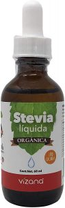
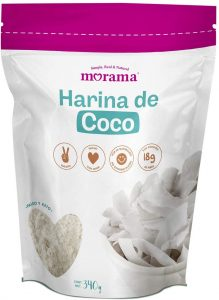
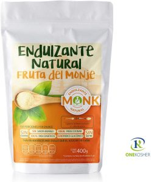
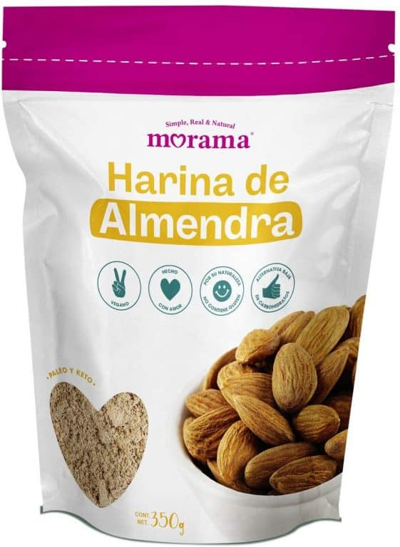

Las blueberries tienen la mayor cantidad de azúcar por porción de todas las berries permitidas en la dieta cetogénica y la porción utilizada en esta receta es solo 3 gramos netos en ⅛ de taza.

Para la masa la harina de coco no es tan espesa como la harina de almendra, pero se junta mejor.

## Panqueques con Blueberries

- ½ tz. Queso Crema
- 2 Huevos
- ½ cdta. Canela (en polvo)
- 1 cda. Harina de Coco
- 1½ cda. Endulzante Natural (Eritrol, Fruto del Monje)
- 5 gotas Stevia (Líquida)
- 2 cda. Mantequilla con sal (O Aceite de Coco)
- ⅛ tz. Blueberries (Frescas)

1. Mezcla o bate los primeros ocho ingredientes en un tazón o licuadora hasta que quede suave
    
2. Clienta una sartén mediano y engrasar con una cantidad saludable de mantequilla salada o aceite de coco y llevar a fuego medio-alto
    
3. Vas a hacer dos panqueques, uno a la vez, serán más delgados que los panqueques tradicionales, pero los hará igual. Vierte la masa y luego agrega los arándanos encima. Cocine la mayor parte del camino por un lado (espere hasta que vea burbujas) y luego voltee
    
4. (Opcional) una vez que hayas hecho y servido tus panqueques. Con su jarabe de arce de ceto favorito mezclado con mantequilla derretida para agregar grasas, también puede llenarlos con queso crema y enrollarlos como uvas para obtener un gramo adicional de carbohidratos por onza
    

## Encuentra Los Ingredientes Aquí

[Stevia Líquida](https://amzn.to/2OXwATC)

[Harina de Coco](https://amzn.to/3bEM0Wp)

[Eritrol Para Cocinar](https://amzn.to/2OYWmaa)

[Harina de Almendra](https://amzn.to/3bEM0Wp)

**Descargo de responsabilidad**: _Las ligas a los productos anteriores son ligas al programa de afiliados de Amazon México. [AyunoIntermitente.blog](https://ayunointermitente.blog/) gana una comisión cada que uno de ustedes compra uno de estos productos, estas comisiones son para cubrir los gastos en los que incurre el mantenimiento de este sitio web._
